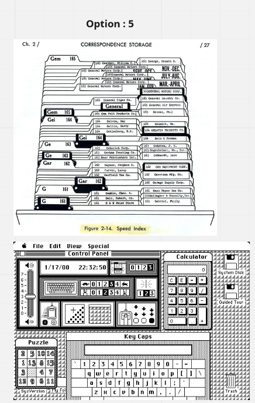
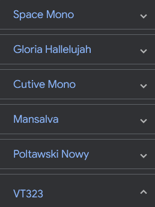
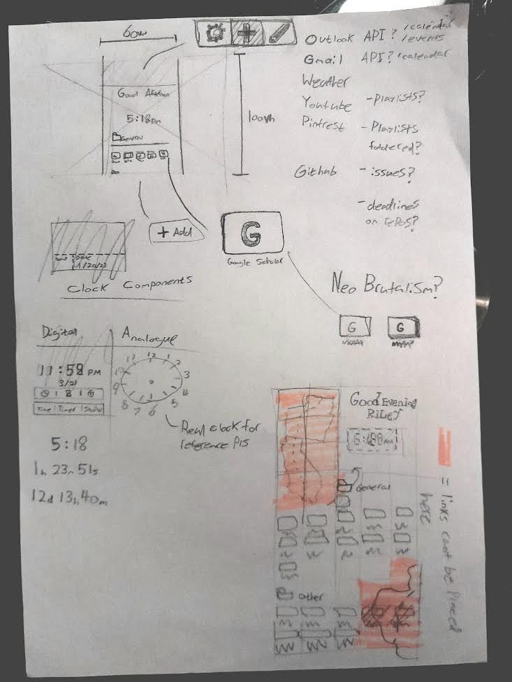
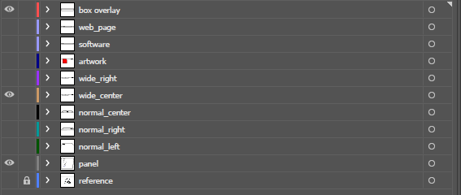
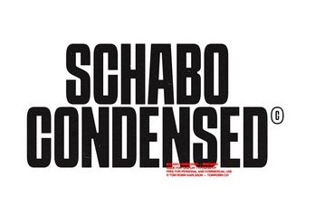
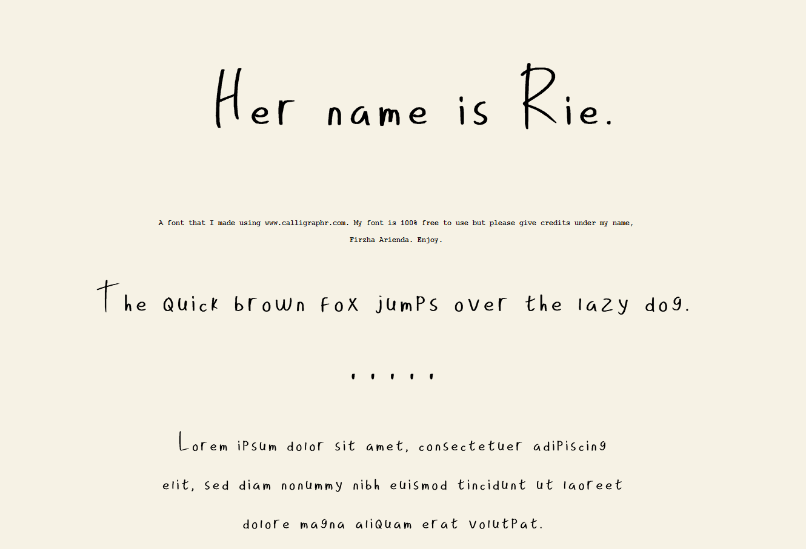
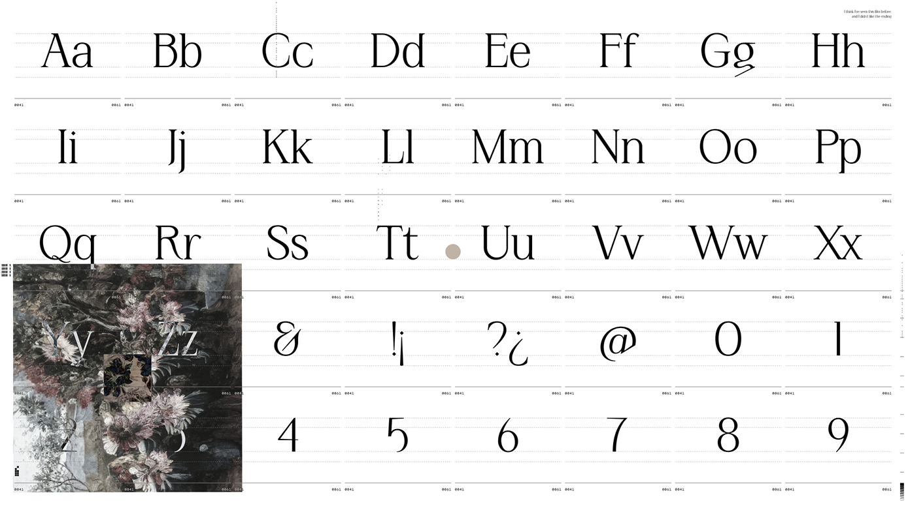
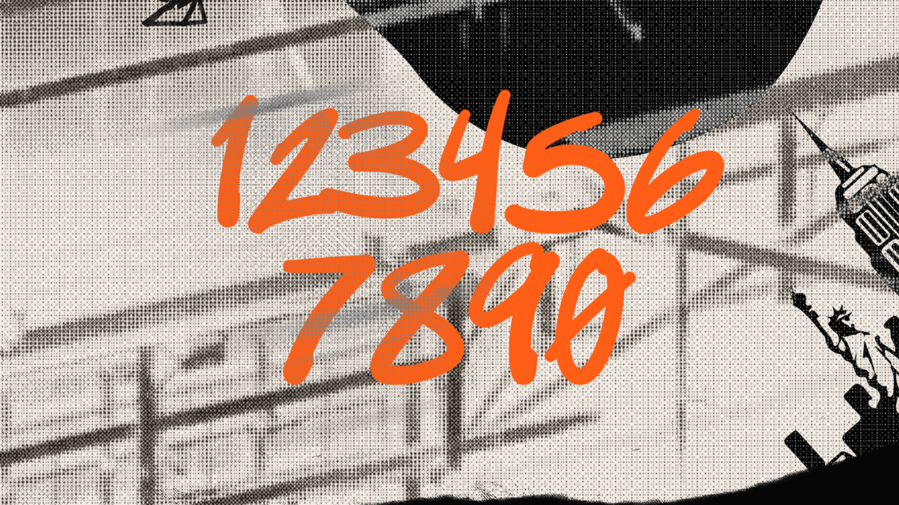

# Bookmarks Extended - Browser Extention

## Synopsis

I started this project as a fork of https://github.com/KM-Bookmarks/bookm-parser
but got rid of all of it because after instaling rust, your code didnt even work for my system for some reason (possibly the last real commit being 7 years ago had something to do with it...) Python for life 😎

This is a bookmarks extender extension. The idea being that it helps autocategorise newly added bookmarks by replacing the current menu with a new menu that uses AI to generate a few of the most likely categories at the top and a search through your folders button for more preciseness if the suggestions weren't good enough.

## Table Of Contents

<!-- TOC -->

- [Bookmarks Extended - Browser Extention](#bookmarks-extended---browser-extention)
  - [Synopsis](#synopsis)
  - [Table Of Contents](#table-of-contents)
- [What am I trying to do exactly?](#what-am-i-trying-to-do-exactly)
  - [Background / where I wanted to go at the start](#background--where-i-wanted-to-go-at-the-start)
  - [What I'm doing now](#what-im-doing-now)
  - [How to use this repo in its curlerent unusable state.](#how-to-use-this-repo-in-its-curlerent-unusable-state)
  - [What each file Is...](#what-each-file-is)
- [Website new tab override](#website-new-tab-override)
- [Python script collection ( conversions )](#python-script-collection--conversions-)
  - [Steps](#steps)
- [Cleaned CSV files to website](#cleaned-csv-files-to-website)
  - [Possible API integrations](#possible-api-integrations)
  - [Color Theory](#color-theory)
  - [Steps](#steps-1)
- [Machine Learning Model](#machine-learning-model)
  - [steps](#steps-2)
- [Big List :)](#big-list-)
- [The Project, Disected \& timed out](#the-project-disected--timed-out)
- [PROJECT LOG](#project-log)
  - [12/5/23](#12523)
    - [Overview](#overview)
    - [Next Steps](#next-steps)
  - [14/5/23](#14523)
    - [Overview](#overview-1)
    - [Next Steps](#next-steps-1)
  - [16/5/23](#16523)
    - [Overview](#overview-2)
    - [Next Steps](#next-steps-2)
  - [20/5/23](#20523)
    - [Overview](#overview-3)
  - [22/5/23](#22523)
    - [Overview](#overview-4)
  - [Next Steps](#next-steps-3)
  - [23/5/23](#23523)
    - [Overview](#overview-5)
  - [25/5/23](#25523)
    - [Overview](#overview-6)
    - [Next Steps](#next-steps-4)
  - [26/5/23](#26523)
    - [Overview](#overview-7)
      - [UI Inspiration](#ui-inspiration)
      - [Not Using](#not-using)
      - [Using](#using)
      - [Fonts](#fonts)
      - [Proposed Plan #1](#proposed-plan-1)
  - [27/5/23](#27523)
    - [Overview](#overview-8)
  - [30/6/23](#30623)
    - [Overview](#overview-9)
    - [Next Steps](#next-steps-5)
  - [1/7/23](#1723)
    - [Overview](#overview-10)
  - [2/7/23](#2723)
    - [Overview](#overview-11)
  - [3/7/23](#3723)
    - [Overview](#overview-12)
    - [Next Steps](#next-steps-6)
  - [5/7/23](#5723)
    - [Overvie](#overvie)

<!-- /TOC -->

# What am I trying to do exactly?

## Background / where I wanted to go at the start

I thought bookmarks would only save 2 seconds of my time each search, slightly useful but most of my searches on the web were using a search engine anyways and saw no point to chaging a system that works for most part, However now that I am a student I am finding it no longer feasible to memorise all the websites for when I need them, I decided to spend a solid 6 hours just organising bookmarks into tabbed folders with subcategories and I now realise how difficult of a task it is to just categorise bookmarks as most of them are edge cases or would be appropriate to fit in multiple folders.

I am currently using NightTab which is a new tab replacer that is populated with bookmarks that you have to add manually. I have configured my nightTab to look really clean and modern and I have reached the point where I have about ~200 bookmarks in nightTab and ~700 bookmarks in firefox. Both of which can be exported, with firefox being in html and nightTab in json. Originally I wanted to just be able to merge the two together and reinterporate them back into json so I could have all my bookmarks in one spot. However I am now realising the potential improvments through digging into the existing bookmark managing tools I currently use.

## What I'm doing now

I have been working on the project for about a week and I have decided there are improvments to do on both of the bookmarking tools. Firstly I do not want to have to manually folder each item when I bookmark, I want to be prompted a few autosuggestions for where the bookmark could go for example, youtube music videos will be prompted into the music categories, the types of music the user is most likely to be listening to will appear at the top ect ect.

I also want to either fork nightTab or make my own newtab web extension that reads and exports to csv and has the ability to import bookmarks from firefox/google/browser and all the other types.

For the autosuggestions to happen I will need a categorisation model and im really not sure how fast this whole project will be... Might need my gamging pc to act as a remote sever to be able to do the machine learning calculations quickly but I will do everything in my power to optimise it with minimal compromise to model accuracy.

    I never understood why people documented code until I went back to try continue old projects after completley forgetting what I was trying to achieve. Please document your code cuz its really hard to know what your trynna achieve or do with your code. The ammount of repos ive seen with absolutley nothing just piss me off now.

## How to use this repo in its curlerent unusable state.

So far the only bits that are working are the two convertion python files (browser bookmarks to csv and nighttab browser extention to csv).
they are located in the src/components/... and are all contained in functions.
for example

```bash

cd src/components

python3 nighttabjson_to_csv.py parse('inputfilelocation+extention','outputfolder+extension')

```

## What each file Is...

- main.py is the main python file, once the whole project is done, this should be the only nessecary file.
- all the other files ending in .py will be used in that main.py file, if one component their names may give hints to what needs debugging.
- the bookmarks.csv is the bookmarks.html cleaned and turned to csv in one.
- the night_tab.csv is the night_tab.json cleaned and turned to csv in one.

This _README.md_ is so people like me and you can remember what the fuck this whole thing means when we move onto another project and forget about all of this.

**Unessesary Added Complexities**
I decided I will be using an ai model to not only categorise the bookmarks and give appropriate quick suggestions but also to help generate favicons. I may also need a icon library such as fontawesome to use in combination.

My only worry currently is that it does not fit everything well enough, like youtube links will probably all come under visual / entertainment even if their content can be drastically different depending on the video

# Website new tab override

[documentation](./bookmark-tab/README.md)

# Python script collection ( conversions )

## Steps

Tasks:

1. Python script to convert bookmarks.html to csv:
2. Python script to convert bookmarks.json to csv:
3. Python script to merge the bookmarks.csv files created in step 1 and step 2:
4. Python script to convert the merged CSV file (created in step 3) back to bookmarks.html:
5. Python script to convert the merged CSV file (created in step 3) back to bookmarks.json:

# Cleaned CSV files to website

Turning the csv generated from the process before (firefox bookmarks to csv and nighttab bookmarks to csv) and using those combined csv files as data to flow into a webpage as their bookmarks under their categories.

For the website I want a focus to be on integrating the python script into it and being able to edit how folders look and interact. With a focus on the data handling and how users can import more data if they wish and formatting data themselves as they please.

## Possible API integrations

- https://github.com/RealFaviconGenerator/rfg-api
- https://realfavicongenerator.net/
- https://github.com/domantasm96/URL-categorization-using-machine-learning
- Machine Learning model to categorise a url into its category

## Color Theory


**(Generated From Coolors)**

    The background color is #0000FF (blue)
    The background color is #228B22 (forest green)
    The background color is #800080 (purple)
    The background color is #1E90FF (dodger blue)
    The background color is #008000 (green)
    The background color is #D8BFD8 (thistle)
    The background color is #006400 (dark green)
    The background color is #F5DEB3 (wheat)
    The background color is #FFFF00 (yellow)
    The background color is #FFD700 (gold)

**(Generated From ChatGPT)**

## Steps

Steps required to create a new tab web extension:

1. Plan your extension: Define the purpose and functionality of your extension. Determine what it will do and what features you need to build.
2. Set up your development environment: Install the necessary software tools, such as a code editor and browser extensions development kit.
3. Create a new extension: Create a new folder for your extension and add a manifest file that specifies the name, version, permissions, and other details of your extension.
4. Design the user interface: Create HTML, CSS, and JavaScript files to define the user interface and functionality of your extension.
5. Set up event listeners: Define event listeners in your extension's JavaScript code to handle user interactions with the user interface.
6. Implement the functionality: Write the JavaScript code to implement the functionality of your extension.
7. Test your extension: Test your extension on different devices and browsers to ensure that it works as intended.
8. Publish your extension: Publish your extension on the Chrome Web Store, Firefox Add-ons, or other extension marketplaces, or distribute it directly to users.
9. Maintain and update your extension: Monitor your extension's performance, fix any bugs or issues that arise, and update it with new features and improvements as needed.

# Machine Learning Model

## steps

To categorize URLs into broad and specialized categories, i will use a supervised classification machine learning algorithm:

1. Data Cleaning:

   - Clean the URLs to remove any irrelevant information (e.g. query strings).
   - Extract features from the URLs that can be used for classification. For example, you can extract the domain name, the length of the URL, the presence of certain keywords in the URL, etc.
   - You can also use external data sources to enrich your dataset, such as adding metadata about the URLs (e.g. from an API that provides information about web pages).

2. Labeling:

   - Label each URL in your dataset with the corresponding broad and specialized categories. You can do this manually or use an existing dataset as a reference.

3. Training:

   - Split your dataset into training and test sets.
   - Train a supervised classification algorithm (e.g. logistic regression, random forest, support vector machine, etc.) on the training set using the features and labels you extracted in steps 1 and 2.
   - Evaluate the performance of the trained algorithm on the test set. You can use metrics such as accuracy, precision, recall, and F1-score to evaluate the performance.

4. Prediction:

   - Use the trained algorithm to predict the categories of new URLs.
   - You can also use the feature importance scores to identify the most important features for classification.

5. Refinement:

   - Refine the algorithm by tuning the hyperparameters and retraining on the entire dataset.
   - You can also consider using techniques such as cross-validation and ensemble methods to improve the performance of the algorithm.

6. Deployment:

   - Deploy the algorithm to categorize new URLs in real-time.

and its basically as easy as that...

# Big List :)

1. Python script to convert bookmarks.html to csv:

   a. such as Beautiful Soup and CSV.

   b. Open the bookmarks.html file using Beautiful Soup and parse the data.

   c. Create a CSV file and write the parsed data into it.

   d. Save the CSV file and close it.

2. Python script to convert bookmarks.json to csv:

   a. Import the necessary libraries, such as JSON and CSV.

   b. Open the bookmarks.json file and load the data into a Python object.

   c. Create a CSV file and write the data from the Python object into it.

   d. Save the CSV file and close it.

3. Python script to merge the bookmarks.csv files created in step 1 and step 2:

   a. Import the necessary libraries, such as CSV.

   b. Open the bookmarks.html CSV and bookmarks.json CSV files and read their data into Python objects.

   c. Combine the data from the two Python objects into a single Python object.

   d. Create a new CSV file and write the merged data into it.

   e. Save the CSV file and close it.

4. Python script to convert the merged CSV file (created in step 3) back to bookmarks.html:

   a. Import the necessary libraries, such as CSV and BeautifulSoup.

   b. Open the merged CSV file and read the data into a Python object.

   c. Create a new bookmarks.html file using BeautifulSoup and write the data from the Python object into it.

   d. Save the bookmarks.html file and close it.

5. Python script to convert the merged CSV file (created in step 3) back to bookmarks.json:

   a. Import the necessary libraries, such as CSV and JSON.

   b. Open the merged CSV file and read the data into a Python object.

   c. Convert the Python object into a JSON object.

   d. Create a new bookmarks.json file and write the JSON object into it.

   e. Save the bookmarks.json file and close it.

6. Machine Learning Model

   b. Clean the URLs to remove any irrelevant information (e.g. query strings).

   c. Extract features from the URLs that can be used for classification. For example, you can extract the domain name, the length of the URL, the presence of certain keywords in the URL, etc.

   d. You can also use external data sources to enrich your dataset, such as adding metadata about the URLs (e.g. from an API that provides information about web pages).

7. [Website](./bookmark-tab/README.md)

---

# The Project, Disected & timed out

| Task                                                                    | Estimated Hours | Assignee    | Status      |
| ----------------------------------------------------------------------- | --------------- | ----------- | ----------- |
| **Yeah, This Might Take Me A Solid Year To Finish**                     |                 |             |             |
| 1. python script that converts Bookmark.html > bookmark.csv             | ~7 hours        | Riley Smith | ✔️          |
| 2. python script that converts Bookmark.json > bookmark.csv             | ~8 hours        | Riley Smith | ✔️          |
| 3. python script that merges the previous two csv files into one        | ~1 hours        | Riley Smith | ✔️          |
| 4. Reverse step 1.                                                      | ~3 hours        | Riley Smith | ✔️          |
| 5. Reverse step 2.                                                      | ~2 hours        | Riley Smith | ✔️          |
| 6. Machine Learning Model 1                                             | ~12 hours       | Riley Smith | Not Started |
| 6. Machine Learning Model 2                                             | ~12 hours       | Riley Smith | Not Started |
| 6. Machine Learning Model 3                                             | ~12 hours       | Riley Smith | Not Started |
| 7.[Basic website](./bookmark-tab/README.md) - **First Release**         | ~2 hours        | Riley Smith | Not Started |
| 8.[Website improvements](./bookmark-tab/README.md) - **Second Release** | >7 hours        | Riley Smith | Not Started |

# PROJECT LOG

this is a log for my progress, intended for just me but can be useful if you want to contribute or just know how the project is going and where its headed.
time format dd/mm/yy because im no psyco.

## 12/5/23


### Overview

This seems like a good spot to finish up for the night. I made the website look nicer and cleaned up the readme so it looks a bit easier to read. Next time I will probably be setting up react as it has been all fine and dandy making the website look nice but its going to need linked lists and data structures and folders and that seems near impossible to do in vanilla js and I know what im doing with react so it shouldnt be too hard.

### Next Steps

- Implement React
- Date and time fetcher
- connect the config file to css variables + some config for date time formats and such?
- Implement Foldered data from a csv
- Searchbar? - at least decide what you will be doing when it comes to searching for links and keywords and such
- Does the json to csv need fixed or was csv not the best idea for foldered data in the first place? offer alternative solutions

## 14/5/23

### Overview

Big one is that I have gone from the boilerplate from the previous log that was written in plain html, js and css into react which should handle procedurally generating the bookmarks and it integrates with node a bit nicer than plain html, css js.

Converted from .conf to .yml just because I like yaml more and It looks like nested items get more readable (https://yaml.org/spec/1.2.2/#example-compact-nested-mapping) which I want because I want to use yaml instead of csv as the final export. It is a smaller file than json and html so it should mean the bookmarks load faster anyways so I see no issue with converting... yet...

css colour variables are now stored in the .yml (YAML) file, have not been connected with css variables yet.

[website now has its own seperated documentation](./bookmark-tab/README.md)

### Next Steps

- Remake orginal website in nextjs
- Date and time fetcher
- connect the config file to css variables + some config for date time formats and such?
- Implement Foldered data from a csv
- Searchbar? - at least decide what you will be doing when it comes to searching for links and keywords and such
- Does the json to csv need fixed or was csv not the best idea for foldered data in the first place? offer alternative solutions

## 16/5/23

### Overview


```
+ Next JS App Converted
+ Clock Added
+ Backend called
```

Useful Youtube tutorials used

- Fireship - Next.js 13 - The Basics https://www.youtube.com/watch?v=__mSgDEOyv8&t=248s
- Alex Eagleson - How to Build Scalable Architecture for your Next.js Project https://www.youtube.com/watch?v=Iu5aZDqZt8E&t=3214s
- Alex seems very competent and good at setting up projects for future proofing and git management, the video is just outdated and some of the imports broke nextjs.

Took inspiration from:
https://github.com/sergiss/react-clock
once everything up and running will add some bool config options such as 24h clock, date format ect...

### Next Steps

- **git autorunner script so I cant upload to github without code working properly, USE** **_HUSKY_**
- Learn how pocketbase works and integrates with users. Accounts, Config save, Bookmarks backups ect.
- connect the config file to css variables + some config for date time formats and such?
- Implement Foldered data from a csv
- Searchbar? - at least decide what you will be doing when it comes to searching for links and keywords and such
- Does the json to csv need fixed or was csv not the best idea for foldered data in the first place? offer alternative solutions

## 20/5/23

### Overview

Not alot done today, fixed a bug in which the clock component wasnt loading clientside.

## 22/5/23

### Overview

I have redesigned everything in a seperate folder and although this was disruptive it has a working backend sever and is smaller and faster which should be overall good for the project. So far I will just be working on the backend but Will integrate the react files I have so far and figure out what I am doing with the python files, currently im thinking to just convert it all to js for consistency sake.

## Next Steps

- crud - Create, Read, Update, Delete
- Backend - crud users
- Backend - crud bookmarks
- Backend - Oauth
- Web connect to the backend

Below is one way of stoing the data I don't want to do it this way but it covers all data I want to store in one massive unoptimised json blob

```json
"bookmarks": [
	{
	"title": "Cool youtube videos",
	"bg": "303fff",
	"fg": "ffffff",
	"icon": "FaYoutube"
	"children": [
		{
		"link": {
			"url": "https://www.youtube.com/watch?v=7CqJlxBYj-M",
			"title": "Learn the MERN Stack",
			"tags": [
				"cool",
				"youtube",
				"video"
			],
			"visit_count": 1,
			"add_date": 1682698522,
			"last_modified": 1682902432
		},
		"head": {
			"title": ""
			"icon": "FaReact"
		},
		{
		"link": {
			"url": "https://www.youtube.com/watch?v=vQANrgpnztw",
			"title": "SPFDJ | Boiler Room Berlin: Intrepid Skin",
			"tags": [
				"dj",
				"youtube",
				"music",
				"live"
			]
		},
		"head": {
			"title": "DJ"
			"icon": ""
		}
	]
	},
	{
	"title": "Cool youtube videos",
	"bg": "303fff",
	"fg": "ffffff",
	"icon": "FaYoutube"
	"children": [
		{
		"link": {
			"url": "https://www.youtube.com/watch?v=7CqJlxBYj-M",
			"title": "Learn the MERN Stack",
			"tags": [
				"cool",
				"youtube",
				"video"
			],
			"visit_count": 1,
			"add_date": 1682698522,
			"last_modified": 1682902432
		},
		"head": {
			"title": ""
			"icon": "FaReact"
		},
		{
		"link": {
			"url": "https://www.youtube.com/watch?v=vQANrgpnztw",
			"title": "SPFDJ | Boiler Room Berlin: Intrepid Skin",
			"tags": [
				"dj",
				"youtube",
				"music",
				"live"
			]
		},
		"head": {
			"title": "DJ"
			"icon": ""
		}
	]
	}
]
```

The json blob looks like absolute fucking chaos and I will not be using it.

I want to use a backend to push, get, replace and remove data and do not want to force users to edit and push the whole blob when they want to add a link to their bookmarks.

[https://www.baeldung.com/cs/storing-tree-in-rdb](https://www.baeldung.com/cs/storing-tree-in-rdb)


using the above diagram We can see how I will be storing the information.

That for a folder

```json
"id": 0
"parent": NULL
"is_folder": true,
"title": "foldername",
"children_use_parent_style": false,
"folder_icon": "faFolder"
```

For a link inside that folder

```json
"id": 1
"parent": 0
"is_folder": false,
"url": "www.google.com",
"title": "Google",
"header": "faGoogle",
"bg": "fcf",
"fg": "000000"
```

For a folder inside the first folder

```json
"id": 2
"parent": 0
"is_folder": true,
"title": "folder 2!",
"children_use_parent_style": true,
"folder_icon": "faYoutube",
"bg": "000000",
"fg": "ffffff",
"icon": "faVideo"
```

For a link inside that folder inside the original folder using the style explicitly defined in the previous code (bg, fg, icon)

```json
"id": 3
"parent": 2
"is_folder": false,
"url": "www.youtube.com",
"title": "Google",
"header": "faGoogle"
```

## 23/5/23

### Overview

I have redesigned everything in a seperate folder and although this was disruptive it has a working backend sever and is smaller and faster which should be overall good for the project. So far I will just be working on the backend but Will integrate the react files I have so far and figure out what I am doing with the python files, currently im thinking to just convert it all to js for consistency sake.

I have just sucessfully merged the fucked up nextjs app components with a less goofy MERN directory.

I have also connected the working react frontend with the somewhat functional backend.

axios is used in react to request from the backend.

```javascript
axios
  .post("http://localhost:5000/users/add", user)
  .then((res) => console.log(res.data));
/* used to send a post request to that specific endpoint 
which is requesting a json */
```

Web server stuff to type in terminal.

```bash
# nodemon is run with
cd backend
nodemon server

# nodejs (react) is run with
cd b
npm run start
```

## 25/5/23

### Overview

[link to wireframe of settings, new new tab, bookmark save icon thingymabob](https://miro.com/welcomeonboard/b0kxUktVU0V5VENrN1BQS0UwMm90WmUyTGpmb2RIMktVZkx4NVFIU054dkdnMkxjaGRUcFc3RTF4TGwxWDZwTXwzMDc0NDU3MzYyMjY3NzU0NDQ0fDI=?share_link_id=695780015425)

[Gui for tree style inspiration](https://ux.stackexchange.com/questions/18991/is-there-any-alternative-ui-for-tree-structure)

### Next Steps

- Use wireframe to influince design of web page/pages
- Research the first steps of what would be required to conncect the bookmark star on the searchbar to a ml model
- Merge Git repo with main
- prettier config

## 26/5/23

### Overview

Today was all about planning the project to make future Riley's job easier. I might give code flow diagrams a go so all code left to do is use the diagrams and wireframes as this project is once again bigger than initially planned.

#### UI Inspiration



the above inspiration will be used in the design of the webiste. With the main takeway being that we

Use analogue real world symoblic representations to represent where in the tree data you are searching through (top image), even showing type of webpage it links to, cassete tapes for music, posters for artwork, formal paper for formal reports, websites that have many subwebsites as thin folders, ect

Use a grid system (bottom image) to show where on the website a component is to be placed, also maybe allowing users to move where things are in the grid and whether they want to show some things.



#### Not Using

- Space mono - too futuristic
- Gloria - too sketchy and bubly & creepy / mansalava did it better

#### Using

- cutive mono - code / formal /
- manalava - informal /
- poltawski nowy - homely / formal / professional
- vt323 - Codey / statistical / reliability / automated

#### Fonts



#### Proposed Plan #1

... on miro...

## 27/5/23

### Overview

Merged unstable local project back into git project

## 30/6/23

### Overview

Got took over with final exams, however I have a solid week to work unobstructed on this project and I am feeling very confident about it.

I have restarted several times trying to simplify the process and have just succesfully linted a json file and exported as a json with correct child folders and will be using it as a guide for my javascript when I use with the web.

Was extremley fast in python, processed 904 bookmarks through a linter, spellcheck, format unionisation and redundant text removal then converted to a tree style json in less than 1s ~0.44 megabytes.

```json
[
    {
        "id": 1,
        "parent": 0,
        "title": "",
        "url": null,
        "type": 2,
        "children": [
            {
                "id": 3,
                "parent": 1,
                "title": "toolbar",
                "url": null,
                "type": 2,
                "children": [
                    {
                        "id": 14,
                        "parent": 3,
                        "title": "arts",
                        "url": null,
                        "type": 2,
                        "children": [
                            {
                                "id": 15,
                                "parent": 14,
                                "title": "darek zabrocki",
                                "url": "https://www.artstation.com/zabrocki",
                                "type": 1,
                                "children": []
                            },
                            {
                                "id": 16,
                                "parent": 14,
                                "title": "xintong chen",
                                "url": "https://www.artstation.com/zncu",
                                "type": 1,
                                "children": []
                            },
                            {
                                "id": 17,
                                "parent": 14,
								...
								..
								.
```

_snippet from correct & final json_

### Next Steps

I think I want to be sneaky about how I store userdata with some of the unused folders like mobile bookmarks folder to trick mozilla, google cloud servers into storing user config data on their server meaning users can uninstall on one computer and still keep settings also allows cross computer saving and really just stops me needing to operate and manage a database.

- find a way of storing user constants
- calendar & daily weekly task integration? how would that look? are we using ai?
- new tab editing suite??? grid or flex, how would users customise?
- run python from js? http network it all
- get python script either working on all platforms and OS / use the official bookmarks api can users edit bookmarks from new tab or do they have to edit bookmarks through bookmarks tab thingamabob
- connect to spotify, youtube, pinterest

## 1/7/23

### Overview

converting the python scripts to js & deciding to use the [website previously created](WEB-README.md)

## 2/7/23

### Overview

finalised the plan & sketching up components in illustrator as SVG's to be formatted as inline svg's with text replacers then fixing the website hopefully.


_taken heavy influince from pinterest artist, I will reference and modify in final_

started the illustrator file, still more work needs done but looking good so far...

## 3/7/23

### Overview

The following are the zotero templates, I want to order them a bit better

```json
Artwork
Audio Recording
Bill
Blog Post
Book
Book Selection
Case
Conference Paper
Dataset
Dictionary Entry
Document
Email
Encyclopedia Article
Film
Forum Post
Hearing
Interview
Journal Article
Letter
Magazine Article
Manuscript
Map
Newspaper Article
Patent
Podcast
Preprint
presentation
Radio Broadcast
Report
Software
Statute
Thesis
Tv Broadcast
Video Recording
Web Page
```

Example of a better ordering in heirachy / ordered and foldered

```json
{
  "art": {
    "Artwork": {}
  },
  "audio": {
    "Audio Recording": {},
    "Podcast": {},
    "Interview": {}
  },
  "documents": {
    "Books": {
      "Book": {},
      "Book Selection": {}
    },
    "Legal": {
      "Case": {},
      "Patent": {},

```

which has now been modified further to support tags, titles, a brief description, better child handling ect

```json
{
  "art": {
    "title": "art",
    "descriptive_sentence": "Art is something that stimulates an individual's thoughts, emotions, beliefs, or ideas through the senses.",
    "tags": ["art", "visual", "style", "looks"],
    "children": [
      {
        "title": "artwork",
        "descriptive_sentence": "Artwork refers to visual or auditory creations that are intended to be appreciated for their beauty or emotional power.",
        "tags": ["art", "visual", "creative", "aesthetics"],
        "children": []
      }
    ]
  },
  "audio": {
    "title": "audio",
    "descriptive_sentence": "Audio refers to sounds, music, spoken words, or other auditory elements.",
    "tags": ["audio", "sound", "music", "listening"],
    "children": [
      {
        "title": "audio recording",
        "descriptive_sentence": "An audio recording captures sounds, music, or spoken words in a digital or analog format.",
        "tags": ["audio", "recording", "sound", "music"],
        "children": []
```

also would like to use flask as a backend to appropriately run all the Machine learning models and scripts.

Only some of the json gets its individual header art style

So far the ones that get one is:

- web page (not every website, only ones that are being looked at for artistic reasons / web dev help tools)
- software (github links, gitlab, software homepages)
- artwork (2d art with poster image)
- wide right (projects on even number)
- wide center (projects on odd number)
- normal left (Groups with less than 10 panels)
- normal center (default panel on even number)
- normal right (default panel on odd number)



_ref photo taken from adobe illustrator_

from the picture we see 3 shown things, the panel which is the text and body of each document, wide_center which is the panels specified header style. Then the box overlay.

```markdown
Title

(science, healt ect) Category
Categorical Weighting

(products) Description
(books & film) Synopsis
(reports) Abstract

Author/s
Illustrator/s
Directr/s
Actor/s

homepage
project directory

Project Start Date
Project End Date
Published Date

export apa
clipboard, file ect ect
```

_every possible variable the user could want_

### Next Steps

- [ ] export every individual svg into the react project and make a function that takes an input of the markdown shown above
- [ ] find and document height of each svg item
- [ ] correct origins for each svg
- [ ] get two working in conjunction together / layering properly
- [ ] use the json file from above to get text and date
- [ ] use beautiful soup to rip all unique text from all webpages
- [ ] use a ml model (bert) to decide what the url and title's most likely parent is from the json list above
- [ ] connect bert and the ml model to **FLASK**
- [ ] use another even better formatted json file with parents, tags, children, descriptions to autofill the panel text
- [ ] ensure a get request works properly from user to **FLASK** database
- [ ] get the data from the backend ml model

data entry example in ideal final form:

```json
[
  {
    "id": "",
    "parent": "0 is root",
    "title": "",
    "description": "",
    "tags": [""],
    "type": "",
    "rights": "MIT",
    "people": {
      "author": [""],
      "editor": [""],
      "illustrator": [""],
      "contributor": [""],
      "translator": [""],
      "actor": [""],
      "director": [""]
    },
    "url": {
      "homepage": "",
      "development": "",
      "wiki": "",
      "image": "www.url.com"
    },
    "dates": {
      "added": "",
      "modified": "",
      "start": "",
      "due": "",
      "published": ""
    }
  }
]
```

some fields meant the same thing so they are just deaufult in the json, and formatted different dependant on the type variable

## 5/7/23

### Overvie

**fonts**



(impact font) [SCHABO CONDENSED](https://www.behance.net/gallery/156647815/SCHABO-CONDENSED-(free-font))



(monospace sketchy font)  [Her name is Rie](https://www.behance.net/gallery/110240687/Her-name-is-Rie-(Free-Font))

credit @ Firzha Arienda/firzlle on Instagram.


This font is distributed under a Creative Commons licence.
Free for Commercial and Personal use. 
 
COMMERCIAL AND NON-COMMERCIAL USE @NEUDEMONIA MUST BE CREDITED



[KRYLON](https://www.behance.net/gallery/133227745/KRYLON-(free-font))



[Brick](https://www.behance.net/gallery/162037091/Brick-Handwritten-Font-(FREE))

https://sesohq.sellfy.store/p/brick-font-by-seso/

if you use in a commercial procuct, you have to pay up $18

