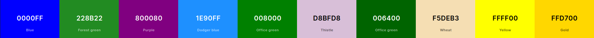

# New Tab Browser Extention $_{(defenitley\ over\ engineered)}$

I started this project using ur code but got rid of alot of it because rust took time to learn and ur thing didnt even work... Python for life 😎

# What am I trying to do exactly?

## Background / where I wanted to go at the start

Firsty I want to say that bookmarks save me 3 seconds of my time and I see no point to it because I have to know what websites are relevant, I have to organise them and I go back to old bookmarks looking through notes and such and realise how much of them arent named properly nor in the right place.

I tried using NightTab which I have configured to look really clean and stylish and I have reached the point where I have about ~200 bookmarks in nightTab and ~700 bookmarks in firefox. Both of which can be exported, with firefox being in html doctype='netscape' and json. Originally I wanted to just be able to merge the two together and reinterporate them back into json so I could have my bookmarks which are my centralised bookmarks and my nighttab being fewer but more relevant bookmarks.

## What I'm doing now

I have been working on the project for about a week and I have decided there are improvments to do on both of the bookmarking tools. Firstly I dont want to have to manually folder each item when I bookmark, I want to be prompted a few autosuggestions for where the bookmark could go for example, youtube music videos will be prompted into the music categories, the types of music the user is most likely to be listening to will appear at the top ect ect.

I also want to either fork nightTab or make my own newtab web extension that reads and exports to csv and has the ability to import bookmarks from firefox/google/browser and all the other types.

For the autosuggestions to happen I will need a categorisation model and im really not sure how fast this whole project will be... Might need my gaming pc to act as a remote sever to be able to do the machine learning calculations quickly but I will do everything in my power to optimise it with minimal compromise to model accuracy.

    I never understood why people documented code until I went back to try continue old projects after completley forgetting what I was trying to achieve. Please document your code cuz its really hard to know what your trynna achieve or do with your code. The ammount of repos ive seen with absolutley nothing just piss me off now.

## Table Of Contents

<!-- TOC -->

- [New Tab Browser Extention $\_{(defenitley\\ over\\ engineered)}$](#new-tab-browser-extention-_defenitley-over-engineered)
- [What am I trying to do exactly?](#what-am-i-trying-to-do-exactly)
  - [Background / where I wanted to go at the start](#background--where-i-wanted-to-go-at-the-start)
  - [What I'm doing now](#what-im-doing-now)
  - [Table Of Contents](#table-of-contents)
  - [How to use this repo in its curlerent unusable state.](#how-to-use-this-repo-in-its-curlerent-unusable-state)
  - [What each file Is...](#what-each-file-is)
- [Python script collection ( conversions )](#python-script-collection--conversions-)
  - [Split into steps](#split-into-steps)
- [Clean CSV to Web](#clean-csv-to-web)
  - [Possible API integrations](#possible-api-integrations)
  - [Color Theory](#color-theory)
  - [Split into steps](#split-into-steps-1)
- [Machine Learning Model](#machine-learning-model)
  - [Split into steps](#split-into-steps-2)
- [BIG LIST :(](#big-list-)
- [**CHAT GPT GENERATED SCHEDULE/PLANNING**](#chat-gpt-generated-scheduleplanning)
- [The Whole Thing...](#the-whole-thing)

<!-- /TOC -->

## How to use this repo in its curlerent unusable state.

So far the only bits that are working are the two convertion python files (browser bookmarks to csv and nighttab browser extention to csv).
they are located in the src/components/... and are all contained in functions.
for example

```bash
cd src/components
python3 nighttabjson_to_csv.py parse('inputfilelocation+extention','outputfolder+extension')
```

## What each file Is...

- main.py is the main python file, once the whole project is done, this should be the only nessecary file.

- all the other files ending in .py will be used in that main.py file, if one component their names may give hints to what needs debugging.

- the bookmarks.csv is the bookmarks.html cleaned and turned to csv in one.
- the night_tab.csv is the night_tab.json cleaned and turned to csv in one.

This README.md is so people like me and you can remember what the fuck this whole thing means when we move onto another project and forget about all of this.

**Unessesary Added Complexities**
I decided I will be using an ai model to not only categorise the bookmarks and give appropriate quick suggestions but also to help generate favicons. I may also need a icon library such as fontawesome to use in combination.

My only worry currently is that it doesnt fit everything well enough, like youtube links will probably all come under visual / entertainment even if their content can be drastically different depending on the video

# Python script collection ( conversions )

## Split into steps

Steps for each tasks I want done:

1. Python script to convert bookmarks.html to csv:

   a. Import the necessary libraries, such as Beautiful Soup and CSV.

   b. Open the bookmarks.html file using Beautiful Soup and parse the data.

   c. Create a CSV file and write the parsed data into it.

   d. Save the CSV file and close it.

2. Python script to convert bookmarks.json to csv:

   a. Import the necessary libraries, such as JSON and CSV.

   b. Open the bookmarks.json file and load the data into a Python object.

   c. Create a CSV file and write the data from the Python object into it.

   d. Save the CSV file and close it.

3. Python script to merge the bookmarks.csv files created in step 1 and step 2:

   a. Import the necessary libraries, such as CSV.

   b. Open the bookmarks.html CSV and bookmarks.json CSV files and read their data into Python objects.

   c. Combine the data from the two Python objects into a single Python object.

   d. Create a new CSV file and write the merged data into it.

   e. Save the CSV file and close it.

4. Python script to convert the merged CSV file (created in step 3) back to bookmarks.html:

   a. Import the necessary libraries, such as CSV and BeautifulSoup.

   b. Open the merged CSV file and read the data into a Python object.

   c. Create a new bookmarks.html file using BeautifulSoup and write the data from the Python object into it.

   d. Save the bookmarks.html file and close it.

5. Python script to convert the merged CSV file (created in step 3) back to bookmarks.json:

   a. Import the necessary libraries, such as CSV and JSON.

   b. Open the merged CSV file and read the data into a Python object.

   c. Convert the Python object into a JSON object.

   d. Create a new bookmarks.json file and write the JSON object into it.

   e. Save the bookmarks.json file and close it.

# Clean CSV to Web

Turning the csv generated from the process before (firefox bookmarks to csv and nighttab bookmarks to csv) and using those combined csv files as data to flow into a webpage as their bookmarks under their categories.

For the website I want a focus to be on integrating the python script into it and being able to edit how folders look and interact. With a focus on the data handling and how users can import more data if they wish and formatting data themselves as they please.


## Possible API integrations

- https://github.com/RealFaviconGenerator/rfg-api
- https://realfavicongenerator.net/
- https://github.com/domantasm96/URL-categorization-using-machine-learning
- Machine Learning model to categorise a url into its category

## Color Theory


**(Generated From Coolors)**

    If the background color is #0000FF (blue), you could use #FFFFFF (white) for h1 and #1E90FF (dodger blue) for h3. For the background color, you could use #F5DEB3 (wheat), which provides a good contrast with blue and makes the text easy to read.

    If the background color is #228B22 (forest green), you could use #FFFFFF (white) for h1 and #1E90FF (dodger blue) for h3. For the background color, you could use #F5DEB3 (wheat), which provides a good contrast with green and makes the text easy to read.

    If the background color is #800080 (purple), you could use #FFFFFF (white) for h1 and #1E90FF (dodger blue) for h3. For the background color, you could use #D8BFD8 (thistle), which provides a good contrast with purple and makes the text easy to read.

    If the background color is #1E90FF (dodger blue), you could use #FFFFFF (white) for h1 and #0000FF (blue) for h3. For the background color, you could use #F5DEB3 (wheat), which provides a good contrast with blue and makes the text easy to read.

    If the background color is #008000 (green), you could use #FFFFFF (white) for h1 and #1E90FF (dodger blue) for h3. For the background color, you could use #F5DEB3 (wheat), which provides a good contrast with green and makes the text easy to read.

    If the background color is #D8BFD8 (thistle), you could use #000000 (black) for h1 and #800080 (purple) for h3. For the background color, you could use #FFFFFF (white), which provides a good contrast with thistle and makes the text easy to read.

    If the background color is #006400 (dark green), you could use #FFFFFF (white) for h1 and #1E90FF (dodger blue) for h3. For the background color, you could use #F5DEB3 (wheat), which provides a good contrast with dark green and makes the text easy to read.

    If the background color is #F5DEB3 (wheat), you could use #000000 (black) for h1 and #800080 (purple) for h3. For the background color, you could use #FFFFFF (white), which provides a good contrast with wheat and makes the text easy to read.

    If the background color is #FFFF00 (yellow), you could use #000000 (black) for h1 and #800080 (purple) for h3. For the background color, you could use #006400 (dark green), which provides a good contrast with yellow and makes the text easy to read.

    If the background color is #FFD700 (gold), you could use #000000 (black) for h1 and #800080 (purple) for h3. For the background color, you could use #F5DEB3 (wheat), which provides a good contrast with gold and makes the text easy to read.

**(Generated From ChatGPT)**

## Split into steps

Steps required to create a new tab web extension:

1. Plan your extension: Define the purpose and functionality of your extension. Determine what it will do and what features you need to build.

2. Set up your development environment: Install the necessary software tools, such as a code editor and browser extensions development kit.

3. Create a new extension: Create a new folder for your extension and add a manifest file that specifies the name, version, permissions, and other details of your extension.

4. Design the user interface: Create HTML, CSS, and JavaScript files to define the user interface and functionality of your extension.

5. Set up event listeners: Define event listeners in your extension's JavaScript code to handle user interactions with the user interface.

6. Implement the functionality: Write the JavaScript code to implement the functionality of your extension.

7. Test your extension: Test your extension on different devices and browsers to ensure that it works as intended.

8. Publish your extension: Publish your extension on the Chrome Web Store, Firefox Add-ons, or other extension marketplaces, or distribute it directly to users.

9. Maintain and update your extension: Monitor your extension's performance, fix any bugs or issues that arise, and update it with new features and improvements as needed.

# Machine Learning Model

Ummmm.

This may take a while...

## Split into steps

To categorize URLs into broad and specialized categories, you can use a supervised machine learning algorithm such as a classification algorithm. Here are the steps you can follow:

1. Preprocessing:

   - Clean the URLs to remove any irrelevant information (e.g. query strings).
   - Extract features from the URLs that can be used for classification. For example, you can extract the domain name, the length of the URL, the presence of certain keywords in the URL, etc.
   - You can also use external data sources to enrich your dataset, such as adding metadata about the URLs (e.g. from an API that provides information about web pages).

2. Labeling:

   - Label each URL in your dataset with the corresponding broad and specialized categories. You can do this manually or use an existing dataset as a reference.

3. Training:

   - Split your dataset into training and test sets.
   - Train a supervised classification algorithm (e.g. logistic regression, random forest, support vector machine, etc.) on the training set using the features and labels you extracted in steps 1 and 2.
   - Evaluate the performance of the trained algorithm on the test set. You can use metrics such as accuracy, precision, recall, and F1-score to evaluate the performance.

4. Prediction:

   - Use the trained algorithm to predict the categories of new URLs.
   - You can also use the feature importance scores to identify the most important features for classification.

5. Refinement:

   - Refine the algorithm by tuning the hyperparameters and retraining on the entire dataset.
   - You can also consider using techniques such as cross-validation and ensemble methods to improve the performance of the algorithm.

6. Deployment:
   - Deploy the algorithm to categorize new URLs in real-time.

and its basically as easy as that...

# BIG LIST :(

1. Python script to convert bookmarks.html to csv:

   a.
   , such as Beautiful Soup and CSV.

   b. Open the bookmarks.html file using Beautiful Soup and parse the data.

   c. Create a CSV file and write the parsed data into it.

   d. Save the CSV file and close it.

2. Python script to convert bookmarks.json to csv:

   a. Import the necessary libraries, such as JSON and CSV.

   b. Open the bookmarks.json file and load the data into a Python object.

   c. Create a CSV file and write the data from the Python object into it.

   d. Save the CSV file and close it.

3. Python script to merge the bookmarks.csv files created in step 1 and step 2:

   a. Import the necessary libraries, such as CSV.

   b. Open the bookmarks.html CSV and bookmarks.json CSV files and read their data into Python objects.

   c. Combine the data from the two Python objects into a single Python object.

   d. Create a new CSV file and write the merged data into it.

   e. Save the CSV file and close it.

4. Python script to convert the merged CSV file (created in step 3) back to bookmarks.html:

   a. Import the necessary libraries, such as CSV and BeautifulSoup.

   b. Open the merged CSV file and read the data into a Python object.

   c. Create a new bookmarks.html file using BeautifulSoup and write the data from the Python object into it.

   d. Save the bookmarks.html file and close it.

5. Python script to convert the merged CSV file (created in step 3) back to bookmarks.json:

   a. Import the necessary libraries, such as CSV and JSON.

   b. Open the merged CSV file and read the data into a Python object.

   c. Convert the Python object into a JSON object.

   d. Create a new bookmarks.json file and write the JSON object into it.

   e. Save the bookmarks.json file and close it.

6. Machine Learning Model
   a. Preprocessing:
   - Clean the URLs to remove any irrelevant information (e.g. query strings).
   - Extract features from the URLs that can be used for classification. For example, you can extract the domain name, the length of the URL, the presence of certain keywords in the URL, etc.
   - You can also use external data sources to enrich your dataset, such as adding metadata about the URLs (e.g. from an API that provides information about web pages).

b. Labeling:

- Label each URL in your dataset with the corresponding broad and specialized categories. You can do this manually or use an existing dataset as a reference.

c. Training:

- Split your dataset into training and test sets.
- Train a supervised classification algorithm (e.g. logistic regression, random forest, support vector machine, etc.) on the training set using the features and labels you extracted in steps 1 and 2.
- Evaluate the performance of the trained algorithm on the test set. You can use metrics such as accuracy, precision, recall, and F1-score to evaluate the performance.

d. Prediction:

- Use the trained algorithm to predict the categories of new URLs.
- You can also use the feature importance scores to identify the most important features for classification.

e. Refinement:

- Refine the algorithm by tuning the hyperparameters and retraining on the entire dataset.
- You can also consider using techniques such as cross-validation and ensemble methods to improve the performance of the algorithm.

f. Deployment:

- Deploy the algorithm to categorize new URLs in real-time.

7. Web Browser Extention
   a. Plan your extension: Define the purpose and functionality of your extension. Determine what it will do and what features you need to build.

b. Set up your development environment: Install the necessary software tools, such as a code editor and browser extensions development kit.

c. Create a new extension: Create a new folder for your extension and add a manifest file that specifies the name, version, permissions, and other details of your extension.

d. Design the user interface: Create HTML, CSS, and JavaScript files to define the user interface and functionality of your extension.

e. Set up event listeners: Define event listeners in your extension's JavaScript code to handle user interactions with the user interface.

f. Implement the functionality: Write the JavaScript code to implement the functionality of your extension.

g. Test your extension: Test your extension on different devices and browsers to ensure that it works as intended.

h. Publish your extension: Publish your extension on the Chrome Web Store, Firefox Add-ons, or other extension marketplaces, or distribute it directly to users.

i. Maintain and update your extension: Monitor your extension's performance, fix any bugs or issues that arise, and update it with new features and improvements as needed.

---

Oh dear god tht was alot to process...

# **CHAT GPT GENERATED SCHEDULE/PLANNING**

    Note: The time estimates are rough approximations and may vary based on individual experience and working speed.

| Task                                                                                                                                                                                          | Estimated Hours | Assignee    | Status             |
| --------------------------------------------------------------------------------------------------------------------------------------------------------------------------------------------- | --------------- | ----------- | ------------------ |
| **Python script to convert bookmarks.html to csv:**                                                                                                                                           | ~3 hours        |             |                    |
| 1. Import the necessary libraries                                                                                                                                                             | >0.1 hours      | Riley Smith | :heavy_check_mark: |
| 2. Open the bookmarks.html file using Beautiful Soup and parse the data                                                                                                                       | >0.5 hours      | Riley Smith | :heavy_check_mark: |
| 3. Create a CSV file and write the parsed data into it                                                                                                                                        | >0.1 hours      | Riley Smith | :heavy_check_mark: |
| 4. Save the CSV file and close it                                                                                                                                                             | >0.1 hours      | Riley Smith | :heavy_check_mark: |
| **Python script to convert bookmarks.json to csv:**                                                                                                                                           | ~1 hours        |             |                    |
| 1. Import the necessary libraries                                                                                                                                                             | >0.1 hours      | Riley Smith | :heavy_check_mark: |
| 2. Open the bookmarks.json file and load the data into a Python object                                                                                                                        | >0.5 hours      | Riley Smith | :heavy_check_mark: |
| 3. Create a CSV file and write the data from the Python object into it                                                                                                                        | >0.1 hours      | Riley Smith | :heavy_check_mark:        |
| 4. Save the CSV file and close it                                                                                                                                                             | >0.1 hours      | Riley Smith | :heavy_check_mark:        |
| **Python script to merge the bookmarks.csv files created in step 1 and step 2:**                                                                                                              | ~1 hours        |             |                    |
| 1. Import the necessary libraries                                                                                                                                                             | >0.1 hours      | Riley Smith | :heavy_check_mark:        |
| 2. Open the bookmarks.html CSV and bookmarks.json CSV files and read their data into Python objects                                                                                           | >0.5 hours      | Riley Smith | :heavy_check_mark:        |
| 3. Combine the data from the two Python objects into a single Python object                                                                                                                   | >0.5 hours      | Riley Smith | Not Started        |
| 4. Create a new CSV file and write the merged data into it                                                                                                                                    | >0.1 hours      | Riley Smith | Not Started        |
| 5. Save the CSV file and close it                                                                                                                                                             | >0.1 hours      | Riley Smith | Not Started        |
| **Python script to convert the merged CSV file (created in step 3) back to bookmarks.html:**                                                                                                  | ~3 hours        |             |                    |
| 1. Import the necessary libraries                                                                                                                                                             | >0.1 hours      | Riley Smith | Not Started        |
| 2. Open the merged CSV file and read the data into a Python object                                                                                                                            | >0.5 hours      | Riley Smith | Not Started        |
| 3. Create a new bookmarks.html file using BeautifulSoup and write the data from the Python object into it                                                                                     | >0.5 hours      | Riley Smith | Not Started        |
| 4. Save the bookmarks.html file and close it                                                                                                                                                  | >0.1 hours      | Riley Smith | Not Started        |
| **Python script to convert the merged CSV file (created in step 3) back to bookmarks.json:**                                                                                                  | ~2 hours        |             |                    |
| 1. Import the necessary libraries                                                                                                                                                             | >0.1 hours      | Riley Smith | Not Started        |
| 2. Open the merged CSV file and read the data into a Python object                                                                                                                            | >0.5 hours      | Riley Smith | Not Started        |
| 3. Convert the Python object into a JSON object                                                                                                                                               | >0.1 hours      | Riley Smith | Not Started        |
| 4. Create a new bookmarks.json file and write the JSON object into it                                                                                                                         | >0.1 hours      | Riley Smith | Not Started        |
| 5. Save the bookmarks.json file and close it                                                                                                                                                  | >0.1 hours      | Riley Smith | Not Started        |
| **Machine Learning Model:**                                                                                                                                                                   | ~14 hours       |             |                    |
| 1. Clean the URLs to remove any irrelevant information                                                                                                                                        | >0.1 hours      | Riley Smith | Not Started        |
| 2. Extract features from the URLs that can be used for classification. For example, you can extract the domain name, the length of the URL, the presence of certain keywords in the URL, etc. | >0.5 hours      | Riley Smith | Not Started        |
| 3. Label each URL in your dataset with the corresponding broad and specialized categories. You can do this manually or use an existing dataset as a reference.                                | >0.1 hours      | Riley Smith | Not Started        |
| 4. Split your dataset into training and test sets.                                                                                                                                            | >0.1 hours      | Riley Smith | Not Started        |
| 5. Train a supervised classification algorithm (e.g. logistic regression, random forest, support vector machine, etc.) on the training set using the features and labels                      | >0.1 hours      | Riley Smith | Not Started        |
| 6. Evaluate the performance of the trained algorithm on the test set                                                                                                                          | >0.1 hours      | Riley Smith | Not Started        |
| 7. Use the trained algorithm to predict the categories of new URLs                                                                                                                            | >0.1 hours      | Riley Smith | Not Started        |
| 8. You can also use the feature importance scores to identify the most important features for classification.                                                                                 | >0.1 hours      | Riley Smith | Not Started        |
| 9. Refine the algorithm by tuning the hyperparameters and retraining on the entire dataset.                                                                                                   | >0.1 hours      | Riley Smith | Not Started        |
| 10. You can also consider using techniques such as cross-validation and ensemble methods to improve the performance of the algorithm.                                                         | >0.1 hours      | Riley Smith | Not Started        |
| 11. Deploy the algorithm to categorize new URLs in real-time.                                                                                                                                 | >0.1 hours      | Riley Smith | Not Started        |
| **Website Stuff**                                                                                                  | ~2 hours        |             |                    |
| 1. Import the necessary libraries                                                                                                                                                             | >0.1 hours      | Riley Smith | Not Started        |
| 2. Open the CSV file and read the data into javascript/typescript                                                                                                                            | >0.5 hours      | Riley Smith | Not Started        |
| 3. Prototype the website using faked csv data                                                                                                                                                | >0.1 hours      | Riley Smith | Not Started        |
| 4. stylise, reformat, ensure it works for screenreaders ect                                                                                                                         | >0.1 hours      | Riley Smith | Not Started        |
| 5. Settings tab like in NightTab                                                                                                                                                  | >0.1 hours      | Riley Smith | Not Started        |
| 6. Connect Settings tab to the config file / use config file to make settings tab and cross integrate                                                                                                                                                | >0.1 hours      | Riley Smith | Not Started        |
| 7. How will adding bookmarks work?                                                                                                                                                  | >0.1 hours      | Riley Smith | Not Started        |
| 8. Implement chosen method (I like the idea of replacing the star with our own star & dialogue)                                                                                                                                                  | >0.1 hours      | Riley Smith | Not Started        |
| 9. Implement keybinds and                                                                                                                                                   | >0.1 hours      | Riley Smith | Not Started        |


# The Whole Thing...

| Task                                                             | Estimated Hours | Assignee    | Status             |
| ---------------------------------------------------------------- | --------------- | ----------- | ------------------ |
| **Yeah, This Might Take Me A Solid Year To Finish**              |                 |             |                    |
| 1. python script that converts Bookmark.html > bookmark.csv      | ~7 hours        | Riley Smith | :heavy_check_mark: |
| 2. python script that converts Bookmark.json > bookmark.csv      | ~8 hours        | Riley Smith | In Progress
| 3. python script that merges the previous two csv files into one | ~1 hours        | Riley Smith | Not Started        |
| 4. Reverse step 1.                                               | ~3 hours        | Riley Smith | Not Started        |
| 5. Reverse step 2.                                               | ~2 hours        | Riley Smith | Not Started        |
| 6. Machine Learning Model                                        | ~2 hours        | Riley Smith | Not Started        |
| 7. Basic Web - **First Release**                                        | ~2 hours        | Riley Smith | Not Started        |
| 8. Web Improvments - **Second Release**                                       | >7 hours        | Riley Smith | Not Started        |
